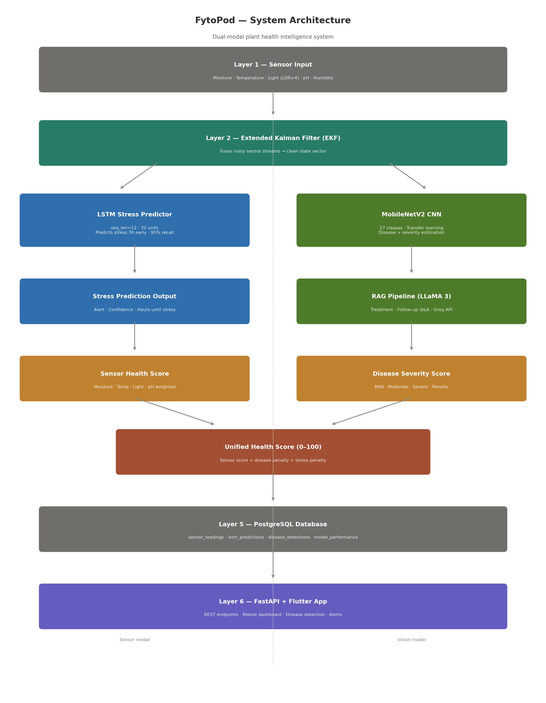
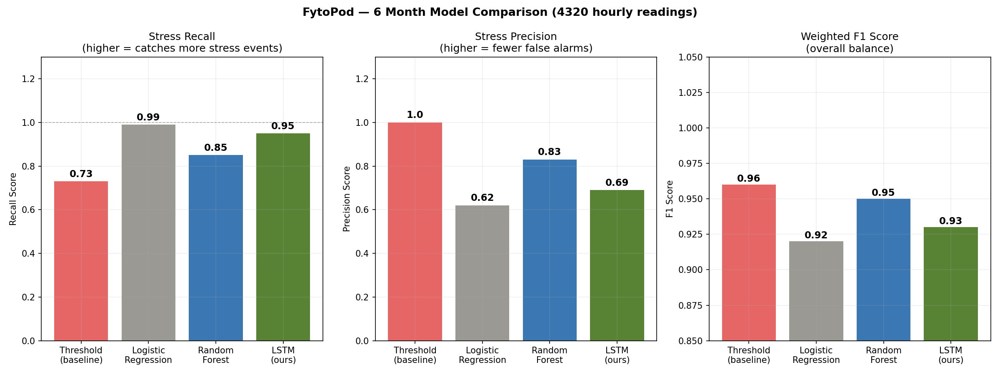
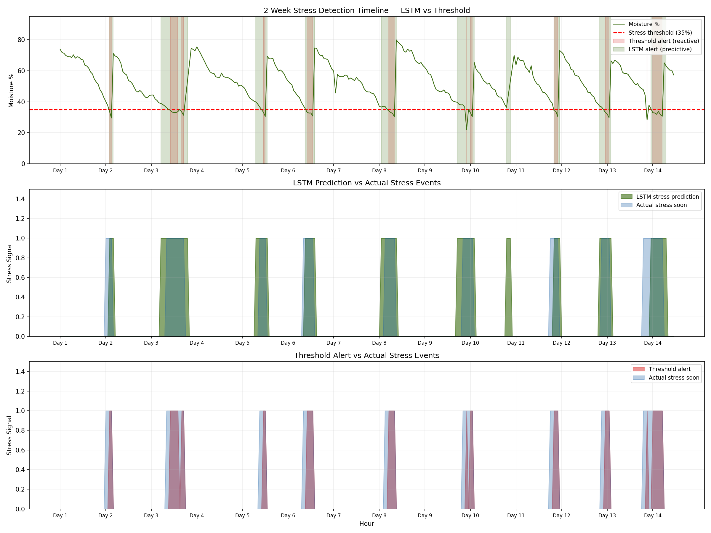
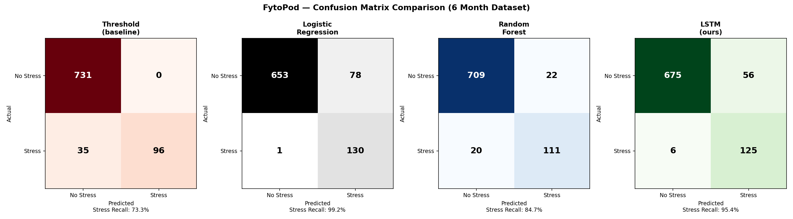
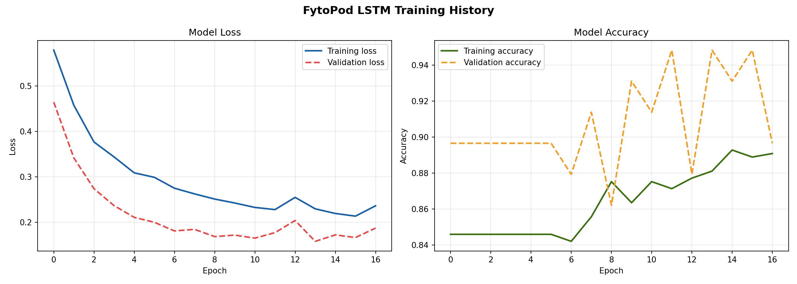

# FytoPod: Predictive Plant Health Intelligence System

FytoPod is a multimodal AI-based plant health monitoring system designed for urban farming, indoor plants, balcony gardening, and small-scale smart agriculture. The project combines sensor-based stress prediction, image-based disease detection, plant lifespan estimation, disease spread forecasting, treatment impact simulation, and a unified plant health score.

The goal of FytoPod is to move plant monitoring from simple observation to predictive plant care by identifying stress conditions early and supporting users with interpretable AI-based recommendations.

## Project Overview

FytoPod integrates multiple AI modules into one plant health intelligence system:

* Sensor-based plant stress prediction using LSTM
* Image-based disease detection using deep learning
* Grad-CAM explainability for model interpretation
* Plant lifespan estimation
* Cellular Automata-based disease spread forecasting
* Treatment impact simulation
* Unified plant health score from 0 to 100
* AI-powered plant care assistant

## System Architecture



## Key Results

| Metric                    |   Result |
| ------------------------- | -------: |
| LSTM stress recall        |      95% |
| Threshold baseline recall |      73% |
| Early warnings generated  |      506 |
| Average advance warning   |  3 hours |
| Sensor data duration      | 6 months |
| Disease classes           |       19 |
| Health score range        | 0 to 100 |

## Technology Stack

| Area             | Tools and Technologies          |
| ---------------- | ------------------------------- |
| Programming      | Python                          |
| Machine Learning | TensorFlow, Keras, Scikit-learn |
| Data Processing  | Pandas, NumPy                   |
| Visualization    | Matplotlib, Seaborn             |
| Backend          | FastAPI                         |
| Database         | PostgreSQL                      |
| App Interface    | Streamlit, Flutter              |
| AI Assistant     | Groq LLaMA 3                    |
| Explainability   | Grad-CAM                        |

## Repository Structure

```text
FytoPod_GitHub/
│
├── app/
│   └── main.py
│
├── notebooks/
│   └── fytopod_lstm.ipynb
│
├── data/
│   └── sample/
│       ├── sensor_data.csv
│       └── sensor_data_6months.csv
│
├── models/
│   ├── fytopod_lstm_model.keras
│   └── fytopod_scaler.pkl
│
├── docs/
│   ├── architecture/
│   └── results/
│
├── .env.example
├── .gitignore
├── requirements.txt
└── README.md
```

## Results and Visualizations

### Model Comparison



### Prediction Timeline



### Confusion Matrix



### Training History



## Dataset Note

The full PlantVillage-based image dataset is not included in this repository due to size limitations. This repository includes sample sensor data, trained model artifacts, project outputs, and result visualizations.

## How to Run

Clone the repository:

```bash
git clone <repository-url>
cd FytoPod-Predictive-Plant-Health-Intelligence
```

Install dependencies:

```bash
pip install -r requirements.txt
```

Create a `.env` file using `.env.example`:

```env
GROQ_API_KEY=your_groq_api_key_here
DB_HOST=localhost
DB_NAME=fytopod
DB_USER=postgres
DB_PASSWORD=your_database_password_here
DB_PORT=5432
```

Run the application:

```bash
python app/main.py
```

## Project Status

This repository contains the implementation and experimental results of the FytoPod final-year project. The project is currently being prepared for academic paper development.

## Future Improvements

* Expand dataset support for household ornamental plants
* Add real-time ESP32 sensor deployment
* Improve mobile application integration
* Add cloud-based model hosting
* Extend disease detection to more indoor plant species
* Improve recommendation generation using plant-specific care history
